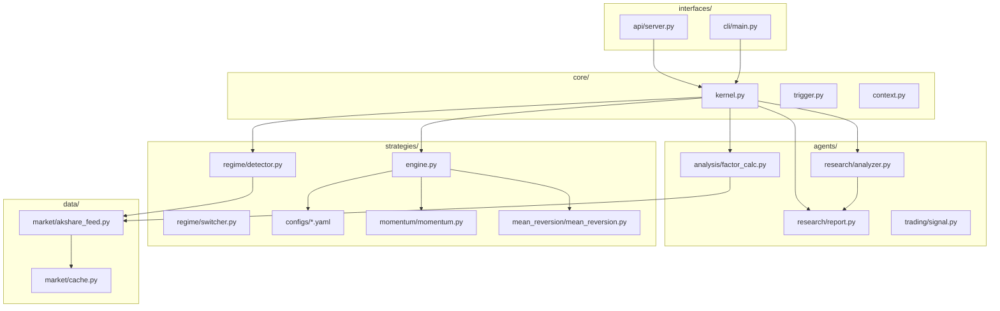

# 系统架构分析

更新时间：2024-06-13（DVexa v1.0 Clean Architecture 重构后）

## 一、当前模块清单

### 目录结构

```
DvexaBFK-main/
│
├── core/                      # 核心引擎
│   ├── engine/
│   │   └── kernel.py          # 主控制循环
│   ├── scheduler/
│   │   └── trigger.py         # 手动触发
│   └── memory/
│       └── context.py         # 上下文记忆
│
├── agents/                    # AI Agent 层
│   ├── research/
│   │   ├── analyzer.py        # 深度分析（LLM）
│   │   └── report.py          # 研究报告生成（标准版）
│   ├── trading/
│   │   └── signal.py          # 交易信号（Phase 2）
│   └── analysis/
│       └── factor_calc.py     # 因子计算（五维 + 技术）
│
├── strategies/                # 策略层（混合式：配置+代码）
│   ├── regime/
│   │   ├── detector.py        # 市场状态识别（牛/熊/震荡）
│   │   └── switcher.py        # 策略自动切换
│   ├── configs/               # YAML 策略配置
│   │   ├── aggressive.yaml    # 牛市进攻策略
│   │   ├── balanced.yaml      # 震荡市均衡策略
│   │   └── defensive.yaml     # 熊市防守策略
│   ├── momentum/
│   │   └── momentum.py        # 动量策略
│   ├── mean_reversion/
│   │   └── mean_reversion.py  # 均值回归策略
│   └── engine.py              # 策略执行引擎
│
├── data/                      # 数据层
│   ├── market/
│   │   ├── akshare_feed.py    # akshare A 股数据源
│   │   └── cache.py           # SQLite 本地缓存
│   └── news/
│       └── news_feed.py       # 新闻数据（Phase 2）
│
├── interfaces/                # 接口层
│   ├── api/
│   │   └── server.py          # FastAPI REST API（4个端点）
│   ├── streamlit/
│   │   └── app.py             # Streamlit UI（可选）
│   └── cli/
│       └── main.py            # 命令行接口
│
├── web/ (DENG-main/)          # React 前端
│   └── src/
│       ├── App.tsx            # 根状态管理
│       ├── api.ts             # API 客户端
│       ├── types.ts           # TypeScript 类型
│       └── components/        # 8 个 UI 组件
│
├── config/                    # 配置
│   ├── settings.py            # 全局配置（LLM/数据/权重）
│   └── weights.py             # 因子权重配置
│
├── DENG的知识库/               # Obsidian 知识库
│
├── start.bat                  # Windows 一键启动
├── stop.bat                   # 停止服务
├── requirements.txt
├── CLAUDE.md
└── README.md
```

---

## 二、每个模块职责

### core/ — 核心引擎

| 文件 | 职责 | 输入 | 输出 |
|------|------|------|------|
| engine/kernel.py | 主控制循环，协调所有模块 | 触发信号 | 分析结果 |
| scheduler/trigger.py | 手动触发分析任务 | 用户操作 | 调用 kernel |
| memory/context.py | 管理会话上下文和历史 | 分析结果 | 上下文数据 |

### agents/ — AI Agent 层

| 文件 | 职责 | 输入 | 输出 |
|------|------|------|------|
| research/analyzer.py | LLM 深度分析股票 | 评分数据 | {catalyst, trend_logic, risk_alert, action} |
| research/report.py | 生成标准版研究报告 | 股票+分析数据 | Markdown 报告 |
| trading/signal.py | 交易信号生成（Phase 2） | 分析结果 | {action, confidence} |
| analysis/factor_calc.py | 五维因子计算 | 财务指标 | {growth, profitability, valuation, health, quality, total_score} |

### strategies/ — 策略层

| 文件 | 职责 | 输入 | 输出 |
|------|------|------|------|
| regime/detector.py | 判断市场状态 | 指数数据 | 'bull' / 'bear' / 'shock' |
| regime/switcher.py | 策略自动切换 | 市场状态 | 策略配置文件名 |
| configs/*.yaml | 策略配置（YAML 外壳） | — | 过滤规则、权重、仓位 |
| momentum/momentum.py | 动量策略实现 | 股票列表 | 筛选结果 |
| mean_reversion/mean_reversion.py | 均值回归策略 | 股票列表 | 筛选结果 |
| engine.py | 策略执行引擎 | 股票+策略配置 | 候选股票 |

### data/ — 数据层

| 文件 | 职责 | 输入 | 输出 |
|------|------|------|------|
| market/akshare_feed.py | akshare A 股数据获取 | 股票代码/行业 | 财务数据、行情 |
| market/cache.py | SQLite 本地缓存 | key-value | 缓存数据 |
| news/news_feed.py | 新闻数据（Phase 2） | 股票代码 | 新闻列表 |

### interfaces/ — 接口层

| 文件 | 职责 | 输入 | 输出 |
|------|------|------|------|
| api/server.py | FastAPI REST API | HTTP 请求 | JSON 响应 |
| streamlit/app.py | Streamlit UI（可选） | 用户操作 | 页面 |
| cli/main.py | 命令行接口 | 命令行参数 | 终端输出 |

### config/ — 配置

| 文件 | 职责 | 内容 |
|------|------|------|
| settings.py | 全局配置 | LLM 配置、数据配置、权重、阈值 |
| weights.py | 因子权重 | 默认/牛市/熊市权重配置 |

---

## 三、依赖关系图

### 模块依赖



### 简化依赖关系

```
interfaces/api/server.py
  └── core/engine/kernel.py
        ├── strategies/regime/detector.py
        │     └── data/market/akshare_feed.py
        ├── strategies/engine.py
        │     ├── strategies/configs/*.yaml
        │     └── strategies/momentum/*.py
        ├── agents/analysis/factor_calc.py
        │     └── data/market/akshare_feed.py
        └── agents/research/
              ├── analyzer.py
              └── report.py
```

---

## 四、数据流

```
用户触发
    ↓
interfaces/api/server.py
    ↓
core/engine/kernel.py
    ↓
┌─────────────────────────────────────────────────────────┐
│ 1. strategies/regime/detector.py                        │
│    └── data/market/akshare_feed.py → 获取沪深300指数    │
│    └── 判断市场状态 → 'bull' / 'bear' / 'shock'        │
│                                                         │
│ 2. strategies/engine.py                                 │
│    └── 加载对应 YAML 配置                               │
│                                                         │
│ 3. data/market/akshare_feed.py                          │
│    └── 获取 A 股列表 + 财务指标                         │
│                                                         │
│ 4. agents/analysis/factor_calc.py                       │
│    └── 计算五维因子 → {growth, profitability, ...}      │
│                                                         │
│ 5. strategies/engine.py                                 │
│    └── 按策略筛选 → Top N 候选                          │
│                                                         │
│ 6. agents/research/analyzer.py                          │
│    └── LLM 深度分析 → {catalyst, trend_logic, ...}      │
│                                                         │
│ 7. agents/research/report.py                            │
│    └── 生成标准版研究报告                               │
└─────────────────────────────────────────────────────────┘
    ↓
返回 {regime, strategy, candidates, reports}
    ↓
前端展示 → 人工确认 → 手动下单
```

---

## 五、已实现 vs 待实现

### ✅ 已实现

| 模块 | 功能 | 文件 |
|------|------|------|
| core/engine | 主控制循环 | kernel.py |
| core/scheduler | 手动触发 | trigger.py |
| agents/research | AI 深度分析 | analyzer.py |
| agents/research | 研究报告生成 | report.py |
| agents/analysis | 五维因子计算 | factor_calc.py |
| strategies/regime | 市场状态判断 | detector.py |
| strategies/engine | 策略执行引擎 | engine.py |
| strategies/configs | 三套 YAML 配置 | aggressive/balanced/defensive.yaml |
| data/market | akshare 数据获取 | akshare_feed.py |
| data/market | SQLite 缓存 | cache.py |
| interfaces/api | REST API | server.py |
| config | 全局配置 | settings.py, weights.py |

### 🔄 Phase 2 待实现

| 模块 | 功能 | 文件 |
|------|------|------|
| agents/trading | 交易信号生成 | signal.py |
| strategies/momentum | 动量策略完整实现 | momentum.py |
| strategies/mean_reversion | 均值回归策略 | mean_reversion.py |
| data/news | 新闻数据源 | news_feed.py |
| risk/ | 风控规则 | 待创建 |
| 回测 | 策略回测框架 | 待创建 |

---

## 六、模块统计

| 类别 | 数量 | 文件数 |
|------|------|--------|
| core/ | 3 模块 | 3 |
| agents/ | 3 模块 | 4 |
| strategies/ | 5 模块 | 8 |
| data/ | 2 模块 | 3 |
| interfaces/ | 3 模块 | 3 |
| config/ | 2 文件 | 2 |
| **总计** | **18 模块** | **23 文件** |

---

## 相关链接

- [[项目需求文档]]
- [[项目技术栈]]
- [[MCP服务清单]]
- [[Claude Code工具]]
